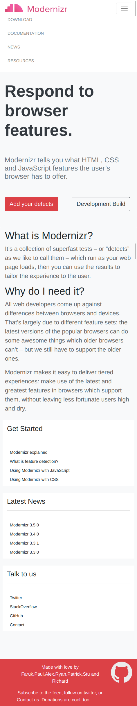

## Column Drop Pattern Challenge

## Context

Responsive Design patterns are used to make a web page responsive across various devices of varying screen sizes.Most design patterns will use breakpoints to adapt for different screen sizes. A Breakpoint is the point at which a different CSS will be applied, usually through a media query, to optimize the design for the user’s viewport. A good example of a breakpoint would be one where your layout has to change from two columns to four columns from one device to another.

For full-width multi-column layouts, column drop simply stacks the columns vertically as the window width becomes too narrow for the content.

Eventually this results in all of the columns being stacked vertically. Choosing breakpoints for this layout pattern is dependent on the content and changes for each design.

## Challenge

Create a Web Page which resembles the images below following Column drop pattern using Bootstrap framework.

### Desktop Image

### Tab Image

### Mobile Image

## Details
1. All the assets required can be found in the `./assets` folder